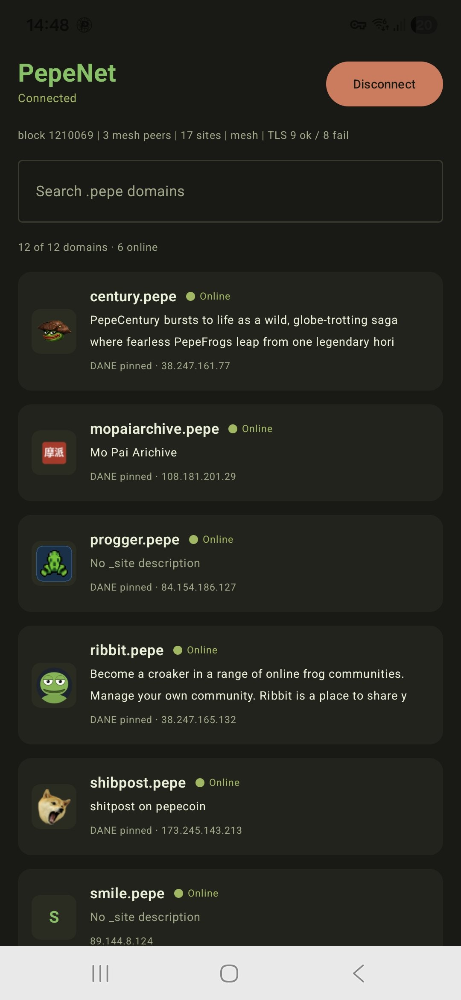

<p align="center">
  
</p>

<h1 align="center">PepeNet for Android</h1>

<p align="center">
  Browse <code>.pepe</code> websites on your phone, with a real padlock.<br>
  <b>Version 0.0.1</b> · Android 10 or newer
</p>

<p align="center">
  <a href="https://github.com/SourceCodeAndStuff/PepeNetAndorid/raw/main/releases/PepeNet-0.0.1.apk"><b>⬇ Download PepeNet-0.0.1.apk</b></a>
</p>

<p align="center">
  
</p>

---

PepeNet runs a complete PepeNet node on your phone. There is no central server:
names are read from the Pepecoin blockchain, website records come from the
PepeNet peer network, and every `.pepe` site is checked against the certificate
fingerprint its owner published on chain before your browser gets a padlock.

## Features

- **One-tap connect.** A local VPN routes only `.pepe` traffic; everything else
  keeps using your normal connection.
- **Verified HTTPS.** Each site's certificate must match the owner's on-chain
  TLSA record (DANE). If it doesn't, the page is blocked with an explanation.
- **Site directory.** Browse every `.pepe` domain the node knows about, with its
  favicon, online status and the owner's `_site` description. Search by name
  or description and tap a domain to open it.
- **Scoped certificate.** The certificate you install can only vouch for `.pepe`
  names. It cannot be used to intercept any other website.

## Install

1. [Download the APK](https://github.com/SourceCodeAndStuff/PepeNetAndorid/raw/main/releases/PepeNet-0.0.1.apk) on your phone.
2. Open it. If Android asks, allow your browser or file manager to
   **install unknown apps**.
3. Open **PepeNet** from your app drawer.

> If you previously installed a build from Android Studio, uninstall it first.

## First-time setup

1. **Connect.** Tap **Connect** and accept the VPN request. The first connect
   downloads name data from Pepecoin peers, which can take a while; the status
   line shows the block height as it syncs.
2. **Install the certificate (once).** Android doesn't allow apps to do this
   automatically, so PepeNet guides you through it. Tap **Install certificate**;
   the file `PepeNet-pepe-root.crt` is saved to Downloads and Settings opens.
   - **Samsung:** Security and privacy → More security settings →
     Install from device storage → CA certificate → Install anyway →
     `PepeNet-pepe-root.crt`
   - **Pixel and most others:** Security → Encryption & credentials →
     Install a certificate → CA certificate → Install anyway →
     `PepeNet-pepe-root.crt`
3. **Restart Chrome.** Return to PepeNet; it detects the certificate and the
   site directory appears. Try [https://ribbit.pepe](https://ribbit.pepe).

## Troubleshooting

| Problem | Fix |
|---|---|
| "App not installed" / "package invalid" | Uninstall any older PepeNet first, then install the APK again. |
| `ERR_CERT_AUTHORITY_INVALID` in Chrome | The certificate isn't installed yet, or Chrome wasn't restarted. Check Settings → View security certificates → User for **pepenet .pepe root CA**. |
| Directory is empty | The node is still syncing. Leave PepeNet connected and check the status line. |
| Site shows **Pin mismatch** | The site's certificate doesn't match what its owner published. PepeNet blocks it on purpose. |
| Something else | Tap **Show node log** in the app and include the log when you open an [issue](https://github.com/SourceCodeAndStuff/PepeNetAndorid/issues). |

**Known limitations in 0.0.1:** Chrome is the tested browser. Apps that ignore
Android's VPN proxy setting can't open `.pepe` HTTPS sites. The APK is signed with
a development key, so future versions signed with a release key will require
uninstalling this one.

## How it works

```
Chrome ──proxy──▶ PepeNet VPN (127.0.0.1:8480)
                     │ .pepe only
                     ▼
                  DANE TLS proxy ──checks TLSA pin──▶ real .pepe origin
                     ▲
          name + record data from
     Pepecoin chain sync + PepeNet mesh
```

| Part | Location |
|---|---|
| Chain sync, `.pepe` resolver, DANE TLS proxy (C, built with the NDK) | [`native/`](native) |
| JNI bridge and directory export | [`native/core/`](native/core) |
| VPN, local proxy, DNS forwarding | [`app/src/main/java/com/example/pepenet/vpn/`](app/src/main/java/com/example/pepenet/vpn) |
| Certificate export and guided install | [`CertificateManager.kt`](app/src/main/java/com/example/pepenet/vpn/CertificateManager.kt) |
| Site directory, favicons and online checks | [`app/src/main/java/com/example/pepenet/directory/`](app/src/main/java/com/example/pepenet/directory) |

## Build from source

Requirements: Android Studio with the **NDK** and **CMake** installed
(SDK Manager → SDK Tools).

```sh
git clone https://github.com/SourceCodeAndStuff/PepeNetAndorid.git
cd PepeNetAndorid
./gradlew :app:assembleRelease     # APK copied to releases/PepeNet-0.0.1.apk
```

In Android Studio use **Build → Assemble Project**. APKs produced by the **Run**
button are marked test-only and can't be installed outside Android Studio.

To test the node on Linux without a phone:

```sh
cmake -S native -B build && cmake --build build
./build/pepenet-headless /tmp/pepenet
```

## Credits and licenses

Built on the [PepeNetWeb](https://github.com/PepeNetWeb) projects
(namespace-protocol, namespace-indexer, pepenet-mesh, pepenet-dns, pepenet-tls,
pepenet-desktop). App icon from
[pepenet-desktop](https://github.com/PepeNetWeb/pepenet-desktop/tree/main/design).

Third-party code in [`native/`](native): libsecp256k1 (MIT, see
[`native/secp256k1/COPYING`](native/secp256k1/COPYING)), SQLite (public domain),
and OpenSSL 3.5.8 static libraries (Apache-2.0) from
[beeware/cpython-android-source-deps](https://github.com/beeware/cpython-android-source-deps).
Details in [`native/README.md`](native/README.md).
